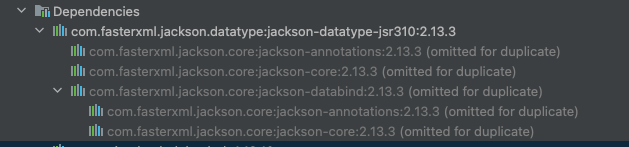

# jackson-deserialization
How to deserialization json to Java8 dateTimes

## Jackson Dependency
```
<dependency>
    <groupId>com.fasterxml.jackson.datatype</groupId>
    <artifactId>jackson-datatype-jsr310</artifactId>
    <version>2.11.0</version>
</dependency>
```
Actually it needs only the following dependency alone, it already includes



https://www.baeldung.com/jackson-serialize-dates
